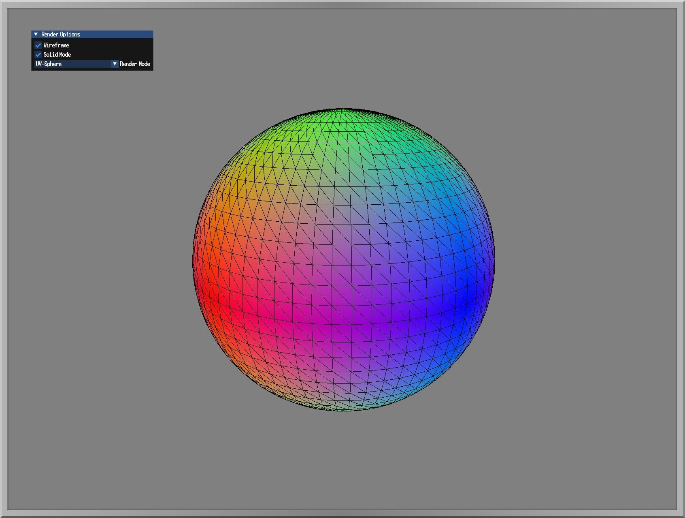
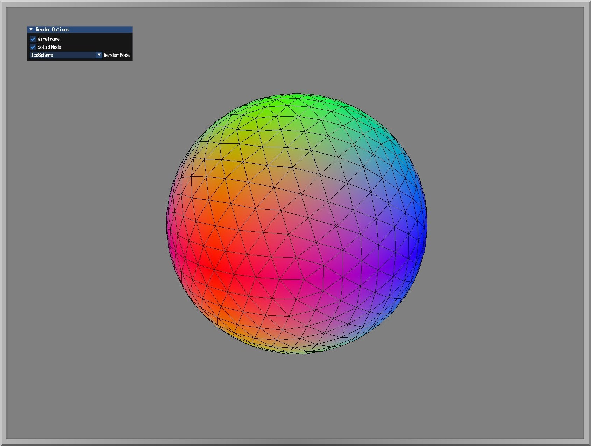
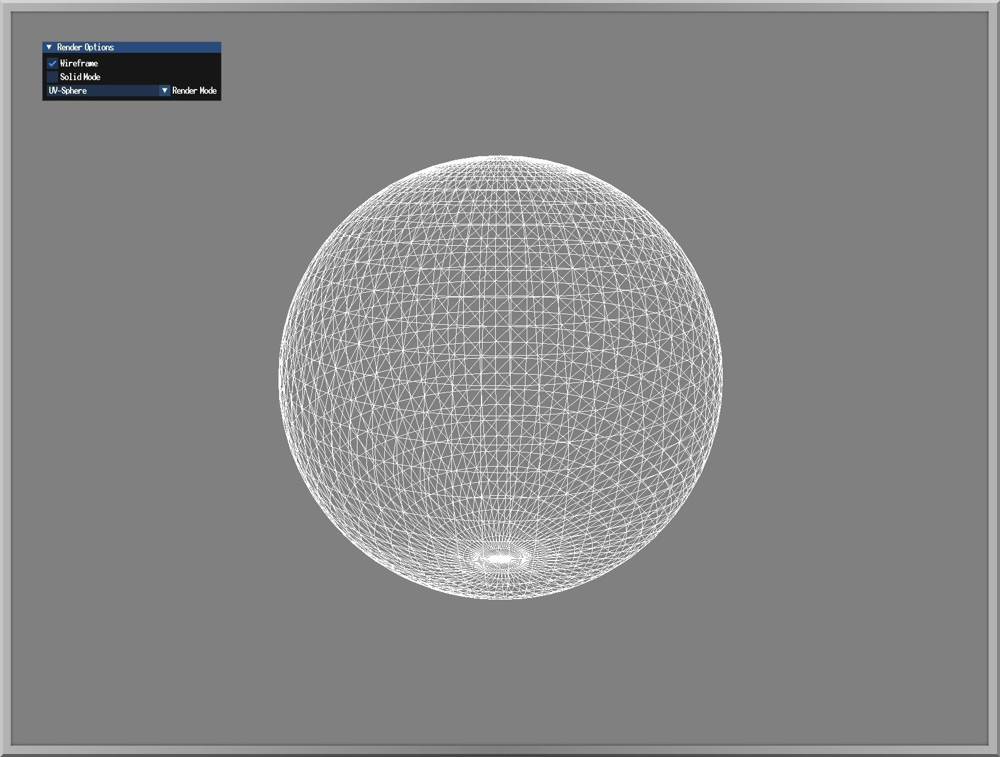

  

# Vulkan Spheres
Procedural sphere generator for Lightweight Vulkan, Contains UV and Icosphere. Ability to switch between wireframe and Fill mode or turn both on at the same time.  
This project serves as a base to be used in prototype shading and texture techniques.

## 😎 Screenshots

  
  
  

## 📦 Features
- UV-Sphere
- Icosphere
- UI for switching different display modes

## 🚀 Getting Started
- Clone the repository using recursive in order to pull the submodules as well.
- `git clone --recurse-submodules https://github.com/RoastedKaju/LVK-Spheres.git`
- Run `cmake -B build` to generate solution file in build folder
- Open the `.sln` file, build and run `Spheres` project.

## 🛠️ Built With
- **Languages**: C++, GLSL
- **Build System**: CMake
- **API**: ImGUI, Lightweight Vulkan
- **Platform**: Windows